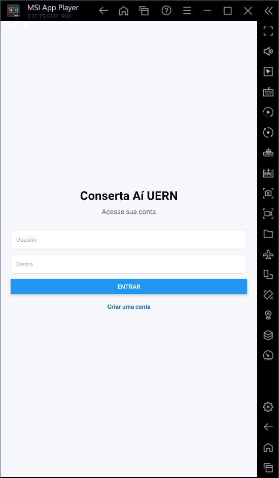
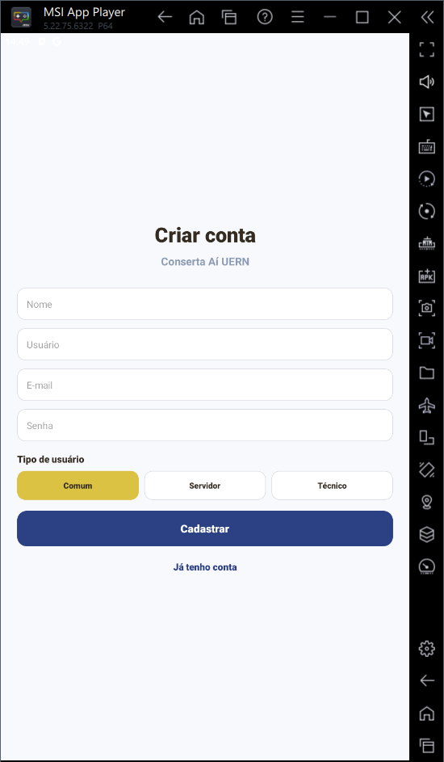
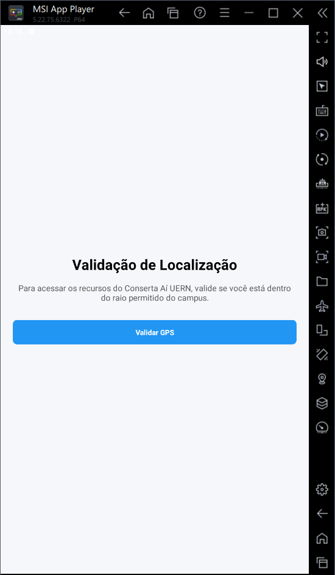
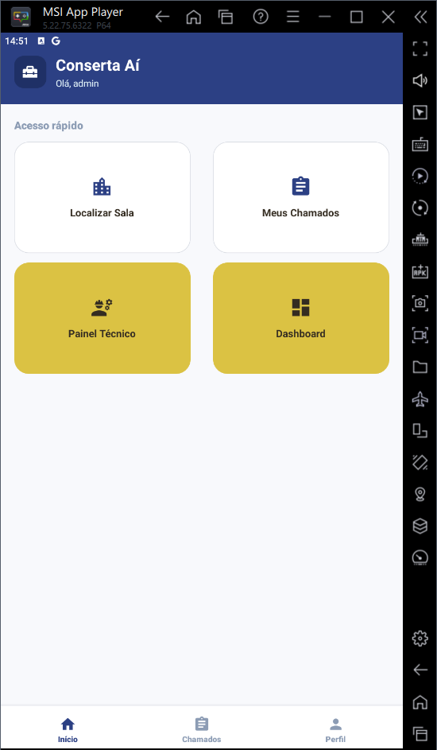
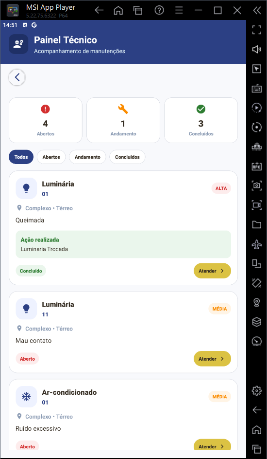
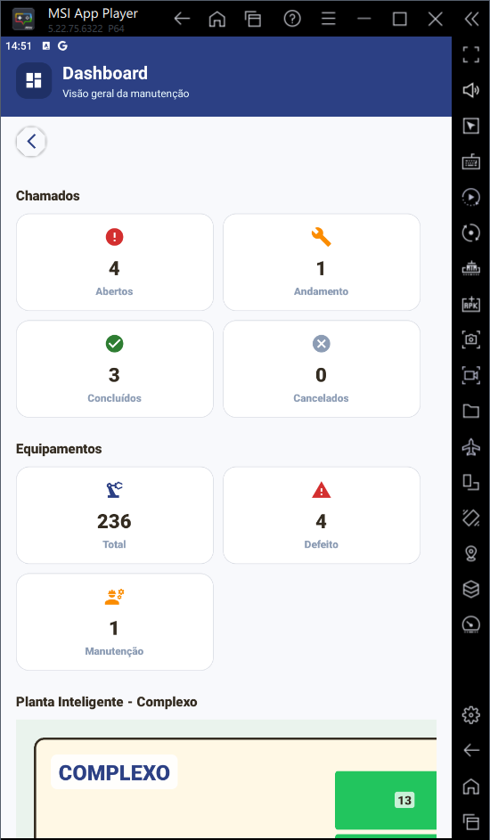
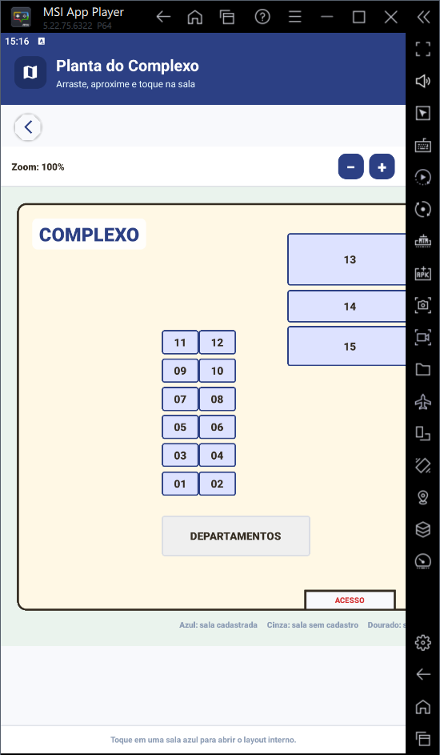
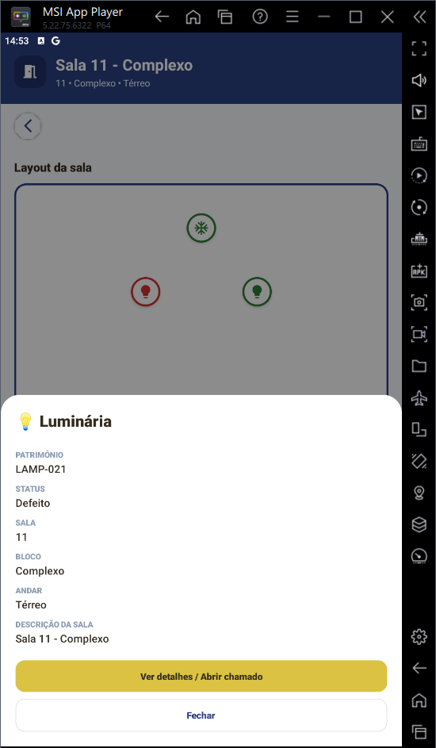
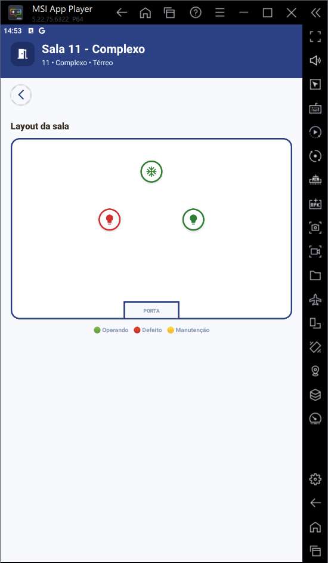
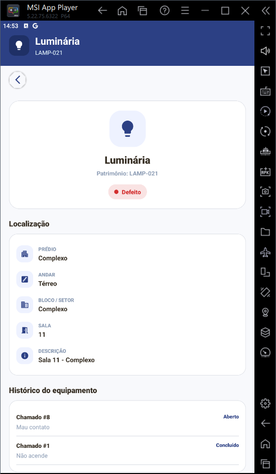

# Conserta Aí

Sistema de gestão de manutenção predial desenvolvido para a Universidade do Estado do Rio Grande do Norte (UERN), permitindo que alunos, servidores e técnicos registrem, acompanhem e gerenciem ocorrências em equipamentos e ambientes da instituição.

## 📱 Capturas de Tela

Confira as principais telas do aplicativo:

<p align="center">
  
  
  
</p>

<p align="center">
<b>Login</b> • <b>Cadastro</b> • <b>Validação de Localização</b>
</p>

---

<p align="center">
  
  
  
</p>

<p align="center">
<b>Tela Inicial</b> • <b>Painel Técnico</b> • <b>Dashboard Administrativo</b>
</p>

---

<p align="center">
  
  
  
</p>

<p align="center">
<b>Planta Inteligente</b> • <b>Informações da Sala</b> • <b>Layout da Sala</b>
</p>

---

<p align="center">
  
</p>

<p align="center">
<b>Detalhes do Equipamento</b>
</p>

### Descrição das telas

| Tela                | Descrição                                                     |
| ------------------- | ------------------------------------------------------------- |
| Login               | Autenticação dos usuários no sistema                          |
| Cadastro            | Criação de contas para usuários comuns, servidores e técnicos |
| Validação GPS       | Verifica se o usuário está dentro do perímetro permitido      |
| Tela Inicial        | Acesso rápido às principais funcionalidades                   |
| Painel Técnico      | Gerenciamento dos chamados pela equipe técnica                |
| Dashboard           | Indicadores gerais e planta inteligente                       |
| Planta Inteligente  | Visualização dos prédios e salas em tempo real                |
| Informações da Sala | Estatísticas e equipamentos da sala selecionada               |
| Layout da Sala      | Representação gráfica dos equipamentos                        |
| Equipamento         | Informações detalhadas e histórico de manutenção              |

## Objetivo

O Conserta Aí tem como objetivo facilitar a comunicação entre a comunidade acadêmica e a equipe de manutenção, permitindo a abertura e acompanhamento de chamados para equipamentos como luminárias e aparelhos de ar-condicionado, além da visualização da localização física dos ambientes através de plantas interativas dos prédios.

## Funcionalidades

### Usuários

* Cadastro de usuários
* Login e autenticação JWT
* Perfis diferenciados:

  * Usuário Comum
  * Servidor
  * Técnico

### Chamados

* Abertura de chamados
* Bloqueio de chamados duplicados para o mesmo equipamento
* Acompanhamento do status dos chamados
* Histórico de chamados por equipamento
* Controle de prioridades

### Controle de Prioridade

Usuários comuns não podem definir prioridades.

Prioridades podem ser definidas apenas por:

* Servidores
* Técnicos

Quando um usuário comum abre um chamado, a prioridade é automaticamente definida como **Média**.

### Equipamentos

Atualmente o sistema gerencia:

* Luminárias
* Ar-condicionados

Cada equipamento possui:

* Patrimônio
* Status operacional
* Histórico de manutenção
* Localização física

### Localização Inteligente

Visualização dos ambientes através de plantas interativas:

#### Complexo Cultural

* Planta navegável
* Seleção visual das salas
* Consulta dos equipamentos presentes

#### Prédio Principal

* Piso 1
* Piso 2

### Painel Técnico

Funcionalidades exclusivas para técnicos:

* Visualização de chamados abertos
* Atualização de status
* Registro de execução
* Controle de manutenção


## Tecnologias Utilizadas

### Backend

* Python 3
* Django
* Django Ninja
* PostgreSQL
* JWT Authentication
* Gunicorn
* Nginx

### Frontend Mobile

* React Native
* Expo
* Expo Router
* TypeScript
* Axios

## Estrutura dos Perfis

### Usuário Comum

Permissões:

* Visualizar salas
* Visualizar equipamentos
* Abrir chamados
* Acompanhar chamados

Restrições:

* Não define prioridade
* Não acessa painel técnico

### Servidor

Permissões:

* Todas do usuário comum
* Definir prioridade dos chamados

### Técnico

Permissões:

* Todas do servidor
* Gerenciar chamados
* Alterar status
* Acessar painel técnico
* Acessar dashboard administrativo

## Arquitetura

```text
React Native (Expo)
          │
          ▼
     Django Ninja API
          │
          ▼
      PostgreSQL
```

## Implantação

### Gunicorn

```bash
gunicorn --bind 127.0.0.1:8010 consertaai.wsgi:application
```

### Nginx

API publicada através do subcaminho:

```text
http://IP_SERVIDOR/api-consertaai/
```

Documentação:

```text
http://IP_SERVIDOR/api-consertaai/docs
```

Admin:

```text
http://IP_SERVIDOR/admin-consertaai/
```

## Desenvolvimento

Executar backend:

```bash
python manage.py runserver
```

Executar frontend:

```bash
npx expo start
```

Gerar APK:

```bash
npx expo prebuild --clean

cd android

./gradlew assembleRelease
```

APK gerado em:

```text
android/app/build/outputs/apk/release/app-release.apk
```

## Autor

Boris Oliveira

Curso de Ciência da Computação – UERN

Wanderson Marques de Macedo Moura

Curso de Ciência da Computação – UERN

Projeto desenvolvido como solução para gerenciamento de manutenção predial em ambientes acadêmicos.
